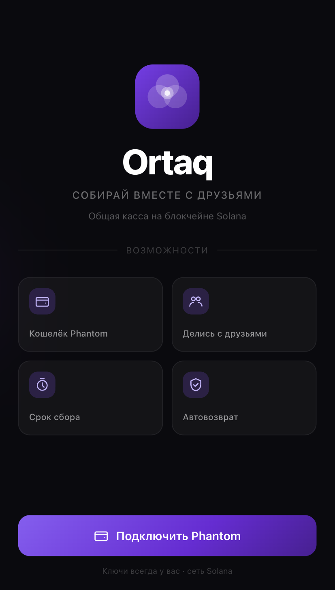
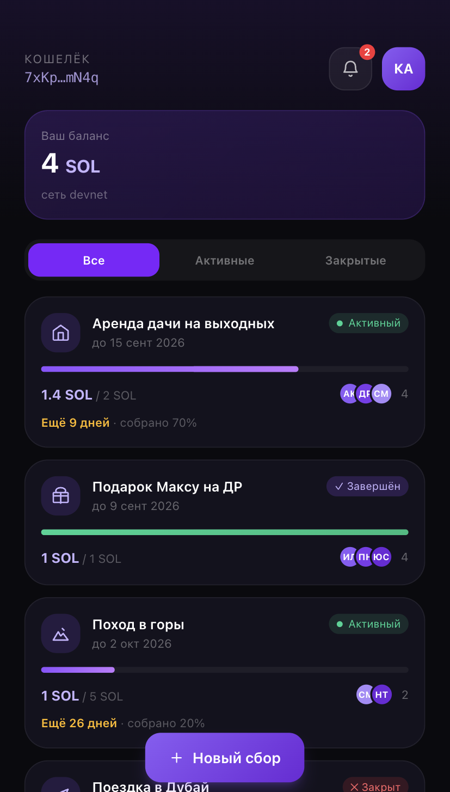
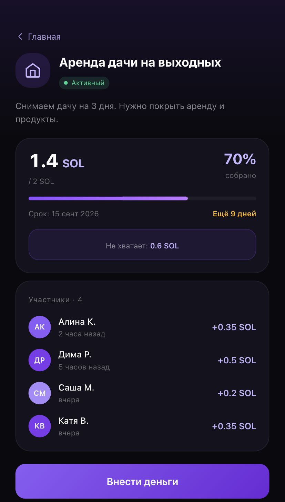
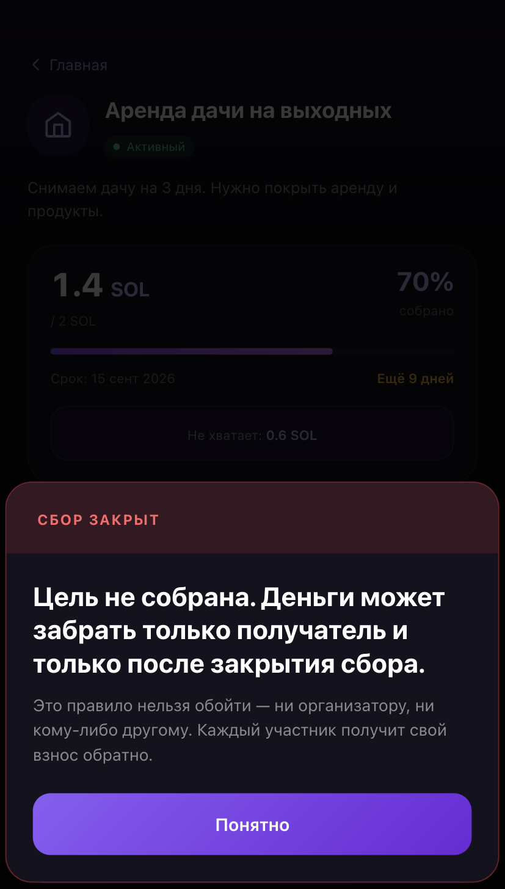

# Ortaq — общая касса без казначея

Деньги на общий сбор держит программа на Solana. До достижения цели их не
трогает никто, включая организатора. Не собрали в срок — взносы возвращаются
участникам.

<p align="left">
  
  
  
  
</p>

## Проблема и решение

### 1. Счёта, принадлежащего группе, не существует

В банковской модели счёт всегда чей-то. Скидываются на подарок, поездку, той —
и деньги лежат у одного человека. Он не злодей, но он единственная точка отказа.

Здесь сбор — это аккаунт программы. Он не принадлежит ни одному из участников.

### 2. Никто не видит, кто уже сдал

Организатор ведёт список в голове или в переписке. Ошибиться легко,
проверить нечем.

Каждый взнос — отдельный аккаунт в цепочке. Список участников и суммы видят
все, у кого есть ссылка на сбор.

### 3. Возврат зависит от добросовестности

Сбор не состоялся — деньги надо вернуть. Вернёт ли, когда и всем ли,
решает человек.

Возврат исполняет программа: после истечения срока при недостигнутой цели
участник забирает свой взнос сам. Организатор в этом не участвует и помешать
не может.

### 4. Организатор не должен иметь права забрать деньги

Получатель фиксируется при создании сбора и потом не меняется. `release`
может вызвать кто угодно, но программа проверяет владельца и mint
токен-аккаунта — деньги всё равно уйдут только получателю. До достижения
цели инструкция отказывает.

## Почему Solana

Правило исполняется само и стоит дёшево: комиссия за взнос — доли цента,
подтверждение меньше секунды. Для сбора между друзьями это важнее, чем
для крупного перевода: люди не станут платить за перевод больше, чем
скидываются.

Второе — трансграничность. Участники сбора часто в разных странах,
а банковский условный счёт на несколько физлиц не открывается ни в одной.

## Возможности

- Сбор с получателем, целью и сроком; получатель фиксируется при создании
- Взносы в SPL-токене, повторный взнос накапливается
- Прогресс, список участников и сумм, обратный отсчёт
- Выплата получателю при достижении цели — вызвать может кто угодно
- Возврат взноса участнику, если срок вышел и цель не собрана
- Подключение кошелька Phantom
- Ссылка на сбор, которой делятся с участниками

## Стек

- **Программа:** Rust, Anchor, SPL Token
- **Клиент:** TypeScript, React, Vite, Tailwind CSS
- **Кошелёк:** Phantom
- **Сеть:** Solana devnet

## Архитектура

```
frontend/            клиент: React + TypeScript + Vite + Tailwind
  src/lib/ortaq/     единственная граница с сетью
programs/pool_tmp/   Anchor-программа
scripts/             раздача тестового токена
tests/               тесты программы
docs/                архитектура
assets/              скриншоты
```

Весь доступ клиента к сети идёт через `frontend/src/lib/ortaq` — компоненты
знают только интерфейс `OrtaqClient`. Реализаций две: `mock.ts` (в памяти,
для разработки экранов) и `chain.ts` (реальная). Переключается `VITE_USE_MOCK`.

Подробнее — [docs/ARCHITECTURE.md](docs/ARCHITECTURE.md).

## Быстрый старт

Нужны Node.js 20+, Rust, Anchor CLI, Solana CLI.

```bash
# клиент
cd frontend
npm install
cp .env.example .env.local
npm run dev            # --host, чтобы открыть с телефона в локальной сети

# программа
anchor build
anchor test
```

По умолчанию клиент работает на моке — программа для этого не нужна.
Чтобы подключить devnet, поставьте `VITE_USE_MOCK=false` и заполните
`VITE_PROGRAM_ID` и `VITE_TOKEN_MINT`.

Тестовый токен раздаётся скриптом:

```bash
ts-node scripts/mint-test-token.ts <адрес участника> ...
```

Program ID (devnet): `AaJbysPdFFNc5anUvuMycEXvbyki7HUaUAMtZVPmUXgt`

## Дорожная карта

- [x] Программа: создание сбора, взнос, выплата, возврат
- [x] Клиент: все экраны, подключение Phantom
- [ ] Клиент на реальной программе вместо мока
- [ ] Возврат без подписи каждого участника
- [ ] Тенге на Solana вместо тестового токена

## Состояние

Прототип. Только devnet и тестовый SPL-токен, мейннета нет.

Суммы — целые числа в базовых единицах токена, 6 знаков: `10.50`
в интерфейсе это `10500000` в программе.

## Команда

- Карим Абрахманов 
- Алексей Грызлов
- 

## Лицензия

[MIT](LICENSE)
